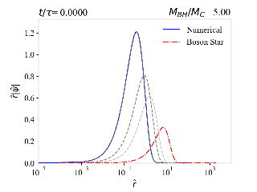
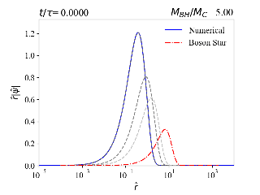

# Scalar Cloud to Boson Star (SC2BS)

## Description

Numerical implementation of the time dependent Poisson-Schrödinger system for a field in the vicinity of an evaporating black-hole [Neves, Daniel and Rosa, João (2025)](https://doi:something). The numerical evolution of the equations are based on a modified Cranck-Nicholson described in [Ringhofer, C. and Soler, J. (1999)](https://doi.org/10.1016/S0893-9659(00)00072-0) and written in the `Fortran90` programming language. We supplement this numerical evolution with a numerical implementation, in `Python`, of an initial field configuration (to be evolved in time) alongside with methods to read and plot the resulting data. 

## Requirements

This project requires `Fortran90` , `Python >= 3.12`, `pip`. The installation process is automated and all the dependencies are
installed if not yet available.

## Installation

### (Recommended) Creating a virtual environment

It is always recommended that you use a virtual environment. First create it:

```
python -m venv venv

# or

python3 -m venv venv

```

And finally activate it:

```
# Unix
source ./venv/bin/activate
```

### Using `pip`

First clone the repository:

```

git clone https://github.com/danielneves1/SC2BS.git
```


And then install the package using `pip`:

```
python -m pip install -e sc2bs

```

 or 
```
python3 -m pip install -e sc2bs
```

## Usage
### How to run

Edit the file `run.sh` with the desired inputs.

```bash
#x-grid properties
xinitial=1e-5 
xfinal=100
ntotal=5000

#black hole + field initial conditions
alpha_ratio=1.3   # Black hole to cloud mass ratio
tau=200 #evaporation time

#time grid properties
tinitial=0
tfinal=300 #tfinal should be greater than tau
time_steps=200 #notice that these time steps are only set after t=tau thus dt=(tfinal-tau)/time_steps
workers=1
runs=1

reduced=False
#Here we set reduced to False because the code that reads and plots
# by default assumes no reduction/simplification, thus
# it would output error if no reduced file exists.

```


Then run as such

```
./run.sh
```
which will generate an initial wave function, run the simulation and do some plots. This file assumes usage of the `gfortran` compiler which can be changed.


### Some detailed information
The initial wave function generation methods are present in the `src/sc2bs/InitialWF` folder upon running:

```
python3 InitialWF/SelfConsistency_Method.py -alpha_ratio="$alpha_ratio" -ntotal="$ntotal" -xinitial="$xinitial" -xfinal="$xfinal" -dir="$file_in" -tau="$tau" -tinitial="$tinitial" -tfinal="$tfinal" -time_steps="$time_steps"
```
This is will mainly output three files: `WF.txt`, `xpoints.txt` and `inp.txt` into the `src/sc2bs/CranckNicholson/Input` folder. Then, after compiling

```
gfortran -o CranckNicholson.exe variables.f90 cloud_potential.f90 ini.f90 Main.f90 math_methods.f90 predictor.f90 wave_function.f90 writers.f90 instants.f90  modulation.f90 -ffree-line-length-none
```

the time evolution of the initial wave function in `WF.txt` on a x-grid defined by `xpoints.txt` is obtained by running the executable

```
./CranckNicholson.exe
```
Notice that the file `inp.txt`, from which the executable reads, has the remaining information for the system. After the simulation has ended, the outputs can be checked inside the folder `src/sc2bs/CranckNicholson/Output`, which can be plotted using the methods provided in `src/sc2bs/Read/`. For further information please read carefully the `run.sh`.


If the output data is already available one can simply run the file `images.sh` to only do the plots:

```
./images.sh
```


### Animations:

We show a preview of the results for simulations A, B and C, following [Neves, Daniel and Rosa, João (2025)](https://doi:something), as animations in the GIF(or MP4) format which can be downloaded fully inside the `Animations` folder or simply by clicking:
[A](https://raw.githubusercontent.com/danielneves1/SC2BS/main/Animations/a.mp4), [B](https://raw.githubusercontent.com/danielneves1/SC2BS/main/Animations/b.mp4), [C](https://raw.githubusercontent.com/danielneves1/SC2BS/main/Animations/c.mp4). Note that the time step between frames is not constant, thus some parts of the animation can appear slowed down.

## A


## B



## C




We also show the same preview results as 2D heatmaps ([A](https://raw.githubusercontent.com/danielneves1/SC2BS/main/Animations/a_p.mp4), [B](https://raw.githubusercontent.com/danielneves1/SC2BS/main/Animations/b_p.mp4), [C](https://raw.githubusercontent.com/danielneves1/SC2BS/main/Animations/c_p.mp4) ) where, at each instant, we normalise the field's value by its maximum value. The colour scheme is such that Yellow corresponds to 1 while Blue corresponds to 0.

## A


## B


## C


## Authors

* Daniel Neves (danielneves@uc.pt)
* João G. Rosa (jgrosa@uc.pt)

## License

**sc2bs** is available under the **MIT** license. 
See the [LICENSE](https://github.com/danielneves1/SC2BS/blob/main/LICENSE)  for more info.

